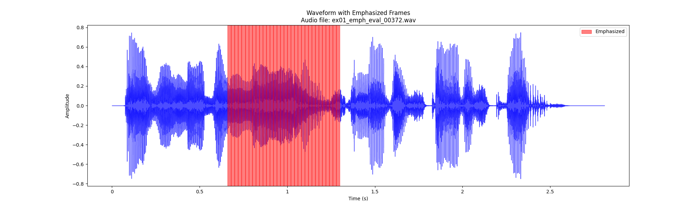

# Overview

This repository presents an evaluation framework for speech-to-speech (S2S) models, following the methodology described in [de Seyssel et al., 2023]([https://arxiv.org/pdf/2312.14069.pdf]).


# Requirements and Installation

- **Python**: Version 3.10 or newer
- **PyTorch**: Version 1.10.0 or newer
- **networkx**: Version 3.2 or newer

1. To create and activate a new conda environment:

    ```bash
    conda create --name emphassess python=3.10
    conda activate emphassess
    ```

2. To install PyTorch, use the following command (ensure the correct version for your setup is selected [here](https://pytorch.org/get-started)):

    ```bash
    pip install torch torchaudio --index-url https://download.pytorch.org/whl/cu118
    ```


3. To clone and install EmphAssess for local development::

    ``` bash
    git clone https://github.com/facebookresearch/emphassess.git
    cd emphassess
    pip install --editable .

    # on MacOS:
    # CFLAGS="-stdlib=libc++" pip install --editable .
    ```


4. Update NetworkX

   Due to an issue with deprecation errors, NetworkX may be inadvertently downgraded to version 2.4 during the process. It is possible to upgrade it afterwards and disregard any warnings—functionality should remain unaffected.

   ```bash
   pip install --upgrade networkx
   ```

# Running EmphAssess evaluation

The EmphAssess evaluation comprises two primary parts: first, the generation of speech output from the EmphAssess dataset, followed by running the evaluation pipeline.

For this, you will need to download two thing : the **EmphAssess dataset** and the checkpoint to our **Emphasis Classifier**.

## Prerequisites
### 1. Downloading the EmphAssess dataset

The EmphAssess dataset can be downloaded [here](https://dl.fbaipublicfiles.com/speech_expressivity_evaluation/EmphAssess/EmphAssess_Dataset.tar.gz).

**LICENSE.** The EmphAssess dataset is distributed under the CC BY-NC 4.0 license.


It consists of a pandas DataFrame under json format `gold_df.json` and corresponding speech input utterances.

The DataFrame includes annotations for emphasis detection in spoken sentences, structured into the following columns:

 - `id`: Unique identifier for each sentence.
 - `src_sentence`: Tokenized source sentence.
 - `gold_emphasis`: Indices of emphasized words in the src_sentence.
 - `voice`: Identifier for the synthesized voice.


#### Example Entry

For instance, the first entry in the dataset is as follows:


    id: ex04_emph_eval_00001
    src_sentence: [add, seven, hours, to, your, two, hour, timer]
    gold_emphasis: [2]
    voice: expresso_ex04


This indicates that in the sentence "add seven hours to your two-hour timer", pronounced by the speaker `ex04`, the word at index 2 ("hours") is emphasized.


---

### 2. Downloading the Emphasis Classifier (EmphaClass) checkpoint

To use `EmphaClass`, our emphasis classifier (XLS-R pretrained model fine-tuned on English emphasis data), download the checkpoint [here](https://dl.fbaipublicfiles.com/speech_expressivity_evaluation/EmphAssess/EmphaClass/EmphaClass-en.tar.gz).

**LICENSE.** The emphasis classifier is distributed under the CC BY-NC 4.0 license.

In subsequent code snippets, we refer to the path to this classifier as `<PATH_TO_CLASSIF_CPT>`. This should be the path to the directory containing the checkpoints, as downloaded from our platform.


---

## First Stage: Generating Utterances from the Speech-to-Speech (S2S) Model

The evaluation methodology is delineated into two principal stages as illustrated in our research. The foremost stage revolves around the synthesis of utterances through the Speech-to-Speech (S2S) model being appraised.

### 1. Output Utterance Generation

- **Process**: Each utterance from the EmphAssess dataset must be converted into a corresponding output by the S2S model being tested. This involves the model interpreting the source sentences and producing the spoken word as an output.

- **Model-Specific Instructions**: This procedure is inherently tied to the S2S model used; hence, instructions for generating outputs will differ. It is recommended to consult the documentation specific to the S2S model for detailed guidance.

### 2. Dataset Preparation for Evaluation

Upon successful generation of output utterances, the next step is to prepare the dataset for evaluation:

- **Copy `gold_df`**: Create a model-specific DataFrame by duplicating the original `gold_df`.
- **Add Columns**: Introduce two new columns:
  - `tgt_lang`: Specify the target language for the generated utterances.
  - `tgt_audiopath`: Incorporate a column that lists the file paths to the output audio files.
- **Save Updated DataFrame**: Preserve the modified pandas DataFrame in a json format file to be utilised in the evaluation phase.

The target language can be any language as long is it is supported by both [WhisperX](https://github.com/m-bain/whisperX) and [SimAlign](https://github.com/cisnlp/simalign). As of 09/11/2023, the full pipeline can process the following languages wihtout any additional tweak : `{en, fr, de, es, it, ja, zh, nl, uk, pt}`.

#### Example Code Snippet for DataFrame Update:

```python
    import pandas as pd

    # Specify the filename of the JSON file
    filename = 'gold_df.json'

    # Read the JSON file into a DataFrame
    gold_df = pd.read_json(filename, orient='records', lines=True)

    # Make a copy to preserve the original DataFrame and work with a model-specific version
    df_MODELX = gold_df.copy()

    # Set target language and update audio file paths
    df_MODELX['tgt_lang'] = 'en'  # Replace 'en' with the appropriate target language code
    df_MODELX['tgt_audiopath'] = df_MODELX.apply(
        lambda row: "your_audio_file_path/{}/{}.wav".format(row['voice'], row['id']),
        axis=1
    )

    # Save the updated DataFrame as a JSON file for MODEL X
    df_MODELX.to_json('df_MODELX.json', orient='records', lines=True)
``````

Make sure the paths in `tgt_audiopath` are correct and the files are accessible.


## Second Stage: Running the Evaluation Pipeline

### Objective
In this stage, your goal is to compare the emphasis in the output utterances generated by your model against the original utterances from the EmphAssess dataset.

### Prerequisites
Ensure that you have:
- Generated output utterances corresponding to the EmphAssess dataset.
- Prepared a model-specific dataframe, e.g., `df_MODELX.json`.

### Evaluation Steps
1. **Activate Your Environment:** Before running the evaluation script, make sure your virtual environment is activated where `emphassess` is installed.

2. **Run the Evaluation Script:** Execute the evaluation by providing the model-specific dataframe and an output directory:

   ```bash
   emphassess <DF_MODEL> <OUTPUT_DIR> --emph_model_path <PATH_TO_CLASSIF_CPT>
   ```
Replace `<DF_MODEL>` with your model-specific dataframe (e.g., `df_MODELX.json`) and `<OUTPUT_DIR>` with the path to the directory where you wish to save the results.

### Review the Results
The evaluation script generates the following outputs:
- **Dataframe**: Contains F1 scores, precision, and recall for each utterance.
- **results.txt**: Provides aggregated metrics:
  - **Overall**: Scores are computed directly across all results.
  - **Averaged**: Scores are first averaged per utterance, then overall.
- **args.txt**: Provides arguments used in the evaluation.


### Additional Information
For a more comprehensive understanding of the available options and detailed usage instructions, consult the script documentation at `src/evaluation_pipeline/scripts/evaluate.py`.


### Testing the pipeline

You can test the evaluation using the test data provided in `test/test_data`` (the waveforms are the same as the ones from the dataset, providing a small test topline).
This should be run from the ghme of the repository.

```bash
   emphassess test/test_data/df_test.json test/output <PATH_TO_CLASSIF_CPT>
```

This should create an output folder and files at `test/test_data`
You should expect to get the following results in `test/test_data/results.txt`:

```
-----
 Overall metrics
 Precision: 1.00, Recall: 0.71, F1 Score: 0.83

------
 Averaged metrics
 Precision: 1.00, Recall: 0.80, F1 Score: 0.87
```


# Direct Emphasis Classification from Audio Files

Included in this repository is the path to `EmphaClass`,  an emphasis classifier for WAV audio files sampled at 16kHz, as presented in [this section](#2-downloading-the-emphasis-classifier-emphaclass-checkpoint). Test the classifier with the following command, and consult the readme in `src/emphasis_classifier`` for more information.


```bash
    classify_emphasis <PATH_TO_AUDIOFILE> --save_dir <PATH_TO_SAVE_DIR> --save_plot True --model_path <PATH_TO_CLASSIF_CPT>
```

This should output a plot with the waveform along with the classified frames like the one shown below, as well as a <audiofile>.txt file with the spans in seconds across which the frames are classified as emphasised.




# Citing Our Work

If you utilise our benchmark, we appreciate a citation:
```
@misc{deseyssel2023emphassess,
      title={EmphAssess : a Prosodic Benchmark on Assessing Emphasis Transfer in Speech-to-Speech Models},
      author={Maureen de Seyssel and Antony D'Avirro and Adina Williams and Emmanuel Dupoux},
      year={2023},
      eprint={2312.14069},
      archivePrefix={arXiv},
      primaryClass={cs.CL}
}
```

<!--- To-do : Add correct citation in bibtex format and APA -->

# License

The majority of EmphAssess is licensed under CC-BY-NC 4.0, however portions of the project are available under separate license terms: SimAlign and Whisper are licensed under the MIT license; WhisperX is licensed BSD-4.

